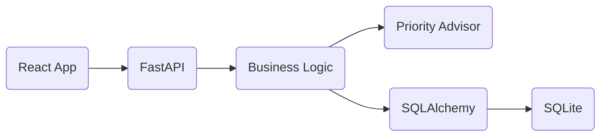

# Documentação Técnica - To-Do API & Frontend

Esta documentação detalha a arquitetura, as tecnologias e os processos de desenvolvimento da aplicação de Gerenciamento de Tarefas.

---

## 1. Visão Geral
O projeto consiste em uma API RESTful para gerenciamento de tarefas (To-Do List) integrada a um frontend moderno. Foi desenvolvido como um MVP (Produto Mínimo Viável) para demonstrar boas práticas de engenharia de software e o uso eficiente de IA generativa.

---

## 2. Arquitetura do Sistema

A aplicação segue o padrão de **Arquitetura em Camadas (Layered Architecture)** no backend, garantindo separação de responsabilidades:

- **Camada de Rotas (Controller):** Gerencia os endpoints HTTP, validação de entrada e respostas.
- **Camada de Serviço (Business Logic):** Onde residem as regras de negócio. Ex: `TaskService`.
- **Camada de Repositório (Data Access):** Abstrai as operações de banco de dados via SQLAlchemy.
- **Camada de Modelo:** Define a estrutura dos dados no SQLite.
- **Camada de Schemas (DTOs):** Define as interfaces de entrada e saída de dados usando Pydantic.

### Diagrama de Fluxo

---

## 3. Modelo de Dados

### Tabela: `tasks`
| Campo | Tipo | Descrição |
|-------|------|-----------|
| `id` | Integer | Chave primária (Autoincrement) |
| `title` | String | Título da tarefa (Indexado) |
| `description` | String | Detalhes adicionais (Opcional) |
| `completed` | Boolean | Status de conclusão (Default: False) |
| `priority` | String | Prioridade: Alta, Média, Baixa |

---

## 4. Lógica de Negócio: PriorityAdvisor

Um diferencial da aplicação é o `PriorityAdvisor`. Ele analisa o título e a descrição da tarefa durante a criação para sugerir uma prioridade automática baseada em palavras-chave:

- **Alta:** Contém "urgente", "crítico", "imediato".
- **Média:** Contém "importante", "breve".
- **Baixa:** Valor padrão para as demais tarefas.

---

## 5. API Reference (Principais Endpoints)

| Método | Endpoint | Descrição |
|--------|----------|-----------|
| `POST` | `/tasks/` | Cria uma nova tarefa |
| `GET` | `/tasks/` | Lista todas as tarefas (suporta filtro `?completed=true/false`) |
| `GET` | `/tasks/{id}` | Busca uma tarefa específica por ID |
| `PUT` | `/tasks/{id}` | Atualiza todos os campos de uma tarefa |
| `PATCH` | `/tasks/{id}/complete` | Altera apenas o status de conclusão |
| `DELETE` | `/tasks/{id}` | Remove permanentemente uma tarefa |

---

## 6. Frontend

O frontend foi construído com **React (TypeScript)** e utiliza o **WEG Design System (@weg-react-ui)**.

### Componentes Utilizados:
- **DataTable:** Para listagem robusta com paginação.
- **Dialog:** Para formulários modais de criação/edição.
- **React Hook Form + Zod:** Para validação de formulários em tempo real.
- **Axios:** Para consumo da API REST.

---

## 7. Estratégia de Testes

A aplicação possui **95% de cobertura** de testes automatizados, divididos em:

1.  **Testes Unitários:** Validam o `TaskService` e `PriorityAdvisor` sem necessidade de banco de dados real ou rede.
2.  **Testes de Integração:** Utilizam `TestClient` para validar o comportamento dos endpoints e a persistência em um banco SQLite temporário (`test.db`).

---

## 8. Processo de Desenvolvimento com IA

A Inteligência Artificial (**Antigravity**) atuou como um **Pair Programmer**, auxiliando em:
- Definição da arquitetura baseada no descritivo do projeto.
- Implementação acelerada do CRUD.
- Geração automática de suítes de testes complexas.
- Documentação técnica e visualização (Mermaid).
- Debugging de schema e encoding de arquivos.

---

## 9. Instruções de Execução

### Backend:
1. Ativar ambiente virtual: `.venv\Scripts\activate`
2. Rodar server: `uvicorn app.main:app --reload`

### Frontend:
1. `cd frontend`
2. `npm install`
3. `npm run dev`
