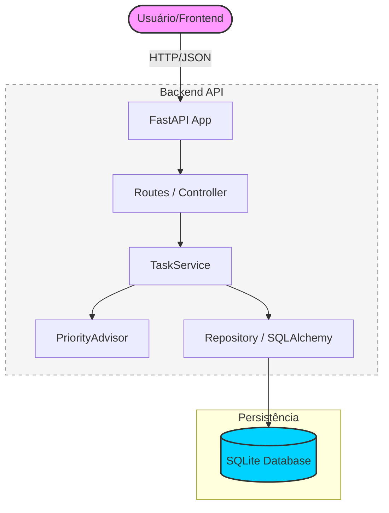

# 📝 To-Do API (Micro-API de Gerenciamento de Tarefas)

## 📌 Descrição

A **To-Do API** é uma micro-API RESTful desenvolvida com foco em demonstrar conceitos de arquitetura mínima, boas práticas de desenvolvimento e uso de Inteligência Artificial no ciclo de vida do software.

A aplicação permite o gerenciamento de tarefas (To-Do List), incluindo criação, listagem, atualização, exclusão e marcação de status (concluída ou pendente).

Este projeto foi desenvolvido como um **Produto Mínimo Viável (MVP)**, com escopo controlado e foco em aprendizado prático.

---

## 🎯 Objetivos do Projeto

* Aplicar conceitos de arquitetura em camadas (Controller, Service, Repository)
* Utilizar IA generativa no desenvolvimento de software
* Implementar uma API RESTful simples e funcional
* Praticar versionamento com Git e GitHub
* Criar documentação técnica clara e objetiva

---

## 🏗️ Arquitetura do Sistema



---

## 🛠️ Tecnologias Utilizadas

### Backend

* Python
* FastAPI
* SQLAlchemy
* Pydantic
* Uvicorn

### Banco de Dados

* SQLite (ambiente local)

### Testes

* Pytest

### Ferramentas de Apoio

* VS Code / Cursor
* Git / GitHub
* IA Generativa (Antigravity - Google DeepMind)

---

## 🏗️ Arquitetura do Projeto

A aplicação segue uma arquitetura em camadas para garantir separação de responsabilidades e facilidade de manutenção:

* **Routes (Controller):** Gerencia as rotas e validações de entrada via FastAPI.
* **Services:** Implementa a lógica de negócio, incluindo o **PriorityAdvisor** para sugestão automática de prioridade.
* **Repository:** Encapsula o acesso a dados usando SQLAlchemy.
* **Models:** Define a estrutura das tabelas no SQLite.
* **Schemas:** Define os contratos de dados (DTOs) usando Pydantic.

---

## 📁 Estrutura de Pastas

```
projeto_pos_ufg/
│
├── app/
│   ├── __init__.py
│   ├── database/
│   ├── models/
│   ├── repository/
│   ├── routes/
│   ├── schemas/
│   ├── services/
│   └── tests/
│       ├── results/         # Relatórios de testes e cobertura
│       └── unit/            # Testes unitários
│
├── .gitignore
├── requirements.txt
└── README.md
```

---

## ⚙️ Como Executar o Projeto

### 1. Clonar o repositório

```
git clone https://github.com/rafaelassis16/projeto_pos_ufg.git
cd projeto_pos_ufg
```

### 2. Criar ambiente virtual

```
python -m venv .venv
```

### 3. Ativar o ambiente virtual

**Windows:**

```
.venv\Scripts\activate
```

**Linux/Mac:**

```
source .venv/bin/activate
```

### 4. Instalar dependências

```
pip install -r requirements.txt
```

### 5. Executar a aplicação

```
uvicorn app.main:app --reload
```

---

## 🎨 Executar Frontend (React)

O frontend foi desenvolvido utilizando o **WEG Design System**.

### 1. Instalar dependências

```bash
cd frontend
npm install
```

### 2. Rodar em modo de desenvolvimento

```bash
npm run dev
```

---

## 🌐 Acessar a API

Documentação interativa (Swagger):

👉 http://127.0.0.1:8000/docs

---

## 📡 Endpoints Principais

### Criar tarefa

```
POST /tasks
```

### Listar tarefas (com filtro opcional)

```
GET /tasks
GET /tasks?completed=true
```

### Buscar tarefa por ID

```
GET /tasks/{id}
```

### Atualizar tarefa (Completo)

```
PUT /tasks/{id}
```

### Marcar como concluída (Parcial)

```
PATCH /tasks/{id}/complete?completed=true
```

### Deletar tarefa

```
DELETE /tasks/{id}
```

---

## 🧪 Testes

Para executar os testes e gerar relatório de cobertura:

```
pytest --cov=app --cov-report=term-missing
```

Os resultados detalhados são salvos em `app/tests/results/`.
### Níveis de Teste Aplicados

1.  **Testes Unitários:** Validam a lógica de negócio no `TaskService` e `PriorityAdvisor` de forma isolada.
2.  **Testes de Integração (API):** Validam os endpoints utilizando `TestClient`, garantindo que rotas, filtros e códigos de status (200, 404, 422) funcionam como esperado.
3.  **Isolamento de Dados:** Utilização de um banco de dados SQLite exclusivo para testes (`test.db`), garantindo a integridade do banco de desenvolvimento.

**Cobertura atual: 95%**

---

## 🤖 Uso de Inteligência Artificial

A IA Generativa (**Antigravity**) foi utilizada como um "Pair Programmer" em todo o ciclo de vida do MVP:

1.  **Ideação e Arquitetura:** Sugestão da estrutura de pastas e divisão em camadas (Service, Repository, Controller) para garantir escalabilidade.
2.  **Geração de Código (CRUD):** Implementação dos modelos SQLAlchemy, schemas Pydantic e lógica de negócio no `TaskService`.
3.  **Lógica Assistida:** Criação do componente `PriorityAdvisor`, que utiliza processamento de texto simples para sugerir prioridades.
4.  **Testes Automatizados:** Escrita completa da suíte de testes (unitários e integração) e configuração de relatórios de cobertura.
5.  **Resolução de Problemas:** Identificação de erros de migração (colunas faltantes) e correção de encoding em logs do Windows.
6.  **Documentação:** Auxílio na criação do diagrama Mermaid e na estruturação profissional deste README.

Este projeto demonstra como a IA pode acelerar o desenvolvimento mantendo a qualidade técnica e seguindo boas práticas de engenharia de software.

---

## 🎨 Frontend (Implementado)

O frontend foi desenvolvido utilizando React com TypeScript e o **WEG Design System (@weg-react-ui)**, seguindo os padrões:
- **Componentes Consistentes:** Uso de `DataTable`, `Dialog`, `Button`, etc.
- **Layout Responsivo:** Grid de 12 colunas para formulários.
- **Formulários:** Integração com `React Hook Form` + `Zod` para validação robusta.
- **Feedback Visual:** Toasts para ações de CRUD.

---

## ⚠️ Limitações

* Não possui autenticação de usuários (Login/JWT)
* Banco de dados local (SQLite)
* Não implementa paginação no backend (feita no frontend pelo DataTable)

---

## 🚀 Próximos Passos

* Implementar autenticação com JWT
* Migrar banco para PostgreSQL (Produção)
* Adicionar paginação e filtros avançados no servidor
* Deploy em ambiente cloud (Docker/Vercel)

---

## 🏷️ Versionamento

Versão atual:

```
v1.0.0
```

## 🛠️ Ferramentas Utilizadas

- **Backend:** Python, FastAPI, SQLAlchemy, SQLite
- **Testes:** Pytest, Pytest-cov
- **IA:** Antigravity (Google DeepMind)
- **IDEs:** Cursor / VS Code

---


## 👨‍💻 Autor

Projeto desenvolvido por **Rafael Amancio**.

---

## 📄 Licença

Este projeto é apenas para fins acadêmicos e de aprendizado.
