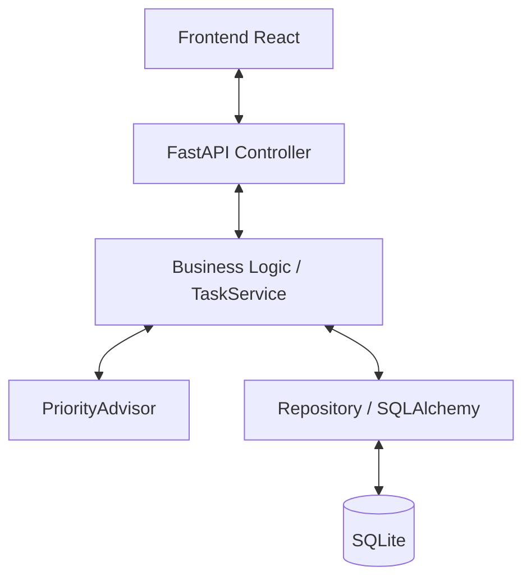

# Roteiro Técnico - To-Do API

Este documento descreve os aspectos técnicos fundamentais do projeto To-Do API, incluindo sua arquitetura, funcionamento e validação.

---

## 1. Problema e Escopo

### O Problema
A necessidade de uma ferramenta simples e eficiente para gerenciar tarefas diárias, permitindo não apenas o registro, mas também uma organização básica baseada em prioridades e status de conclusão.

### Escopo do MVP
- **Backend:** API RESTful robusta com persistência em banco de dados.
- **Frontend:** Interface moderna e responsiva utilizando o WEG Design System.
- **Inteligência:** Sugestão automática de prioridade baseada no conteúdo da tarefa.
- **Qualidade:** Cobertura de testes automatizados acima de 90%.

---

## 2. Arquitetura Resumida

O projeto adota uma **Arquitetura em Camadas (Layered Architecture)** para garantir a separação de responsabilidades e facilitar a manutenção.



- **Controller (Routes):** Gerencia requisições HTTP e validações Pydantic.
- **Service:** Implementa regras de negócio (ex: processamento de prioridade).
- **Repository:** Abstrai o acesso aos dados via ORM SQLAlchemy.
- **Models/Schemas:** Define a estrutura dos dados e contratos da API.

---

## 3. Execução da API

Para facilitar o desenvolvimento, foram criados scripts de automação (Makefile e PowerShell):

### Instalação
```bash
make install
```
*(Cria o ambiente virtual e instala dependências)*

### Inicialização
```bash
make run
```
*(Inicia o servidor Uvicorn em http://127.0.0.1:8000)*

### Configuração de Ambiente
```bash
make setup
```
*(Cria o arquivo .env a partir do exemplo)*

---

## 4. Fluxo CRUD e Prioridade

### Fluxo CRUD
A API suporta as operações fundamentais:
- **CREATE:** `POST /tasks` - Cria uma tarefa.
- **READ:** `GET /tasks` - Lista tarefas (com filtros) e `GET /tasks/{id}`.
- **UPDATE:** `PUT /tasks/{id}` - Atualização completa.
- **PATCH:** `PATCH /tasks/{id}/complete` - Alteração rápida de status.
- **DELETE:** `DELETE /tasks/{id}` - Remoção.

### Lógica de Prioridade (PriorityAdvisor)
Ao criar uma tarefa, o sistema analisa o título e a descrição em busca de palavras-chave para sugerir a prioridade:
- **Alta:** "urgente", "crítico", "imediato".
- **Média:** "importante", "breve".
- **Baixa:** Valor padrão caso nenhuma palavra-chave seja encontrada.

---

## 5. Evidência de Testes

A aplicação foi validada através de uma suíte completa de testes unitários e de integração, garantindo a integridade das regras de negócio e dos endpoints.

### Execução dos Testes
```bash
make test
```

### Resultados de Cobertura
A cobertura atual do backend é de **92%**, conforme evidenciado abaixo:

| Módulo | Cobertura |
| :--- | :--- |
| **Geral (Total)** | **92%** |
| app/services/task_service.py | 94% |
| app/routes/task_routes.py | 88% |
| app/services/priority_advisor.py | 100% |
| app/models/task_model.py | 100% |

Os relatórios detalhados são gerados em HTML no diretório `app/tests/results/htmlcov/`.

### Vídeos de Demonstração
Existem também dois vídeos na pasta `/Videos` que comprovam o funcionamento:
- **Teste backend.mp4**: Execução da suíte de testes.
- **Teste frontend.mp4**: Fluxo completo de uso da interface.
