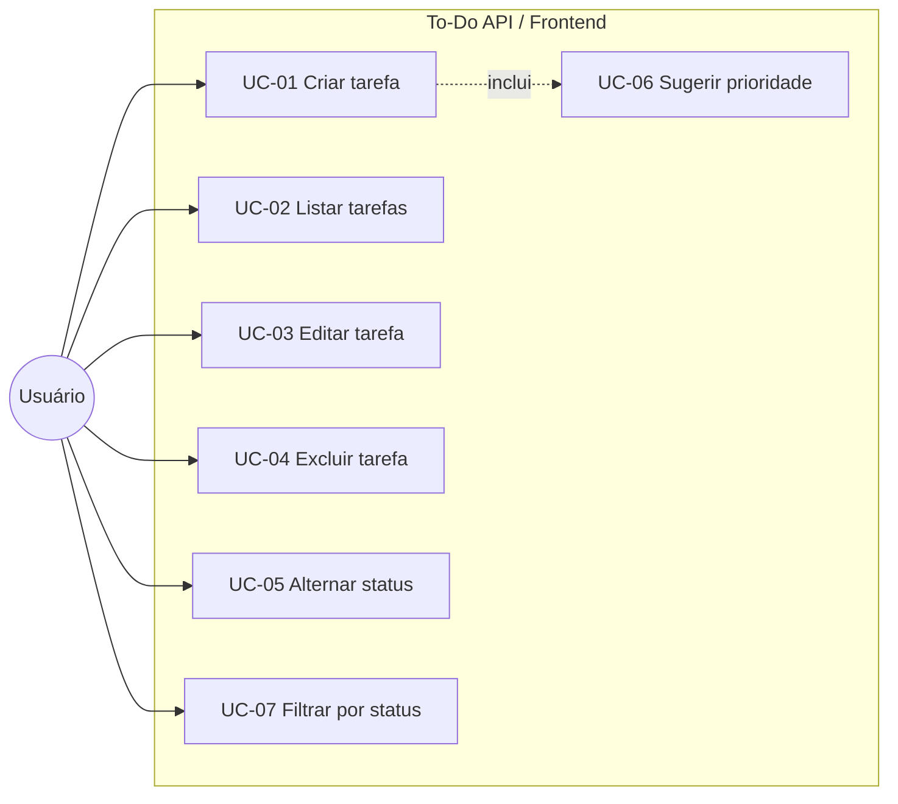

# Artefatos de Especificação de Requisitos

**Projeto:** To-Do API — Micro-API de Gerenciamento de Tarefas  
**Autor:** Rafael Amancio  
**Contexto:** Atividade prática — Unidade de Elicitação e Especificação de Requisitos (Pós-graduação UFG)  
**Repositório:** https://github.com/rafaelassis16/projeto_pos_ufg  
**Versão do documento:** 1.0.0

---

## 1. Visão geral do problema

Usuários precisam de uma ferramenta simples para registrar, organizar e acompanhar tarefas diárias, com indicação de prioridade e status de conclusão. O MVP (Produto Mínimo Viável) entrega:

| Camada | Entrega |
|--------|---------|
| Backend | API RESTful (FastAPI) com CRUD de tarefas e sugestão automática de prioridade |
| Frontend | Interface React + Design System para operação visual do CRUD |
| Persistência | SQLite local |
| Qualidade | Testes unitários e de integração automatizados |

### 1.1 Atores

| Ator | Descrição |
|------|-----------|
| **Usuário** | Pessoa que gerencia suas tarefas pela interface web |
| **Sistema (To-Do API)** | Backend que persiste, valida e aplica regras de negócio |
| **PriorityAdvisor** | Componente interno que sugere prioridade a partir do texto |

> **Nota (escopo do MVP):** não há autenticação nem múltiplos usuários. O “Usuário” representa qualquer pessoa que acesse a aplicação localmente.

---

## 2. Histórias de usuário

Formato: *Como [persona], quero [ação], para [benefício].*  
Prioridade: **Must** (obrigatório no MVP) | **Should** (desejável) | **Could** (futuro).

### HU-01 — Criar tarefa
**Como** usuário,  
**quero** cadastrar uma nova tarefa com título, descrição e prioridade,  
**para** registrar o que preciso fazer e não esquecer.

- **Prioridade:** Must  
- **Épico:** Gerenciamento de tarefas  
- **Critérios de aceitação:** ver [CA-01](#ca-01--criar-tarefa)

### HU-02 — Listar tarefas
**Como** usuário,  
**quero** visualizar todas as minhas tarefas em uma lista organizada,  
**para** ter visão geral do que está pendente e do que já foi concluído.

- **Prioridade:** Must  
- **Épico:** Gerenciamento de tarefas  
- **Critérios de aceitação:** ver [CA-02](#ca-02--listar-tarefas)

### HU-03 — Editar tarefa
**Como** usuário,  
**quero** alterar título, descrição e prioridade de uma tarefa existente,  
**para** corrigir informações ou atualizar o planejamento.

- **Prioridade:** Must  
- **Épico:** Gerenciamento de tarefas  
- **Critérios de aceitação:** ver [CA-03](#ca-03--editar-tarefa)

### HU-04 — Excluir tarefa
**Como** usuário,  
**quero** remover uma tarefa que não é mais necessária,  
**para** manter a lista limpa e relevante.

- **Prioridade:** Must  
- **Épico:** Gerenciamento de tarefas  
- **Critérios de aceitação:** ver [CA-04](#ca-04--excluir-tarefa)

### HU-05 — Marcar tarefa como concluída/pendente
**Como** usuário,  
**quero** alternar o status de uma tarefa entre pendente e concluída com um clique,  
**para** acompanhar o progresso sem precisar editar todos os campos.

- **Prioridade:** Must  
- **Épico:** Controle de status  
- **Critérios de aceitação:** ver [CA-05](#ca-05--marcar-status)

### HU-06 — Sugestão automática de prioridade
**Como** usuário,  
**quero** que o sistema sugira a prioridade com base no título/descrição,  
**para** economizar tempo e classificar tarefas de forma mais consistente.

- **Prioridade:** Should  
- **Épico:** Inteligência assistida  
- **Critérios de aceitação:** ver [CA-06](#ca-06--sugestão-de-prioridade)

### HU-07 — Filtrar tarefas por status (API)
**Como** usuário (ou cliente da API),  
**quero** filtrar tarefas por concluídas ou pendentes,  
**para** focar apenas no subconjunto relevante.

- **Prioridade:** Should  
- **Épico:** Consulta e filtros  
- **Critérios de aceitação:** ver [CA-07](#ca-07--filtrar-por-status)

### HU-08 — Validar campos obrigatórios
**Como** usuário,  
**quero** receber feedback claro quando o título estiver vazio ou inválido,  
**para** não gravar tarefas incompletas.

- **Prioridade:** Must  
- **Épico:** Qualidade dos dados  
- **Critérios de aceitação:** ver [CA-08](#ca-08--validação)

### Backlog futuro (fora do MVP)

| ID | História (resumo) | Prioridade |
|----|-------------------|------------|
| HU-F1 | Autenticar com login/JWT | Could |
| HU-F2 | Paginação no servidor | Could |
| HU-F3 | Múltiplos usuários com isolamento de dados | Could |
| HU-F4 | Notificações de tarefas urgentes | Could |

---

## 3. Casos de uso

### Diagrama de casos de uso (visão geral)



---

### UC-01 — Criar tarefa

| Item | Descrição |
|------|-----------|
| **ID** | UC-01 |
| **Nome** | Criar tarefa |
| **Ator principal** | Usuário |
| **Pré-condições** | Aplicação (frontend e API) em execução |
| **Pós-condições** | Tarefa persistida no banco com `id` gerado e `completed = false` |
| **História relacionada** | HU-01, HU-06, HU-08 |

**Fluxo principal (sucesso):**
1. Usuário aciona “Nova Tarefa”.
2. Sistema exibe formulário (título, descrição, prioridade).
3. Usuário preenche o título (obrigatório) e, opcionalmente, descrição e prioridade.
4. Usuário confirma “Salvar”.
5. Sistema valida os dados.
6. Sistema solicita à API `POST /tasks/`.
7. API aplica `PriorityAdvisor` se a prioridade não for informada de forma explícita no fluxo de negócio (ou reforça classificação conforme implementação).
8. API persiste a tarefa e retorna o recurso criado.
9. Sistema atualiza a lista e exibe feedback de sucesso.

**Fluxos alternativos:**
- **A1 — Título vazio:** no passo 5, a validação (frontend Zod / backend Pydantic) rejeita; usuário permanece no formulário com mensagem de erro.
- **A2 — API indisponível:** no passo 6–8, sistema exibe toast de erro e não altera a lista.

**Regras de negócio associadas:** RN-01, RN-02, RN-03.

---

### UC-02 — Listar tarefas

| Item | Descrição |
|------|-----------|
| **ID** | UC-02 |
| **Nome** | Listar tarefas |
| **Ator principal** | Usuário |
| **Pré-condições** | Aplicação em execução |
| **Pós-condições** | Lista exibida (pode estar vazia) |
| **História relacionada** | HU-02 |

**Fluxo principal:**
1. Usuário acessa a tela principal (ou recarrega após uma ação).
2. Frontend chama `GET /tasks/`.
3. API retorna o conjunto de tarefas.
4. Sistema renderiza a tabela (ID, título, prioridade, status, ações).

**Fluxo alternativo:**
- **A1 — Falha de rede:** toast de erro; lista pode permanecer vazia ou no estado anterior.

---

### UC-03 — Editar tarefa

| Item | Descrição |
|------|-----------|
| **ID** | UC-03 |
| **Nome** | Editar tarefa |
| **Ator principal** | Usuário |
| **Pré-condições** | Existe ao menos uma tarefa listada |
| **Pós-condições** | Campos alterados foram persistidos |
| **História relacionada** | HU-03 |

**Fluxo principal:**
1. Usuário clica em “Editar” na linha da tarefa.
2. Sistema abre o diálogo com dados atuais.
3. Usuário altera campos e salva.
4. Frontend chama `PUT /tasks/{id}`.
5. API atualiza e retorna a tarefa.
6. Lista e feedback de sucesso são atualizados.

**Fluxo alternativo:**
- **A1 — ID inexistente (404):** API retorna 404; frontend informa erro.

---

### UC-04 — Excluir tarefa

| Item | Descrição |
|------|-----------|
| **ID** | UC-04 |
| **Nome** | Excluir tarefa |
| **Ator principal** | Usuário |
| **Pré-condições** | Tarefa existe |
| **Pós-condições** | Tarefa removida permanentemente do banco |
| **História relacionada** | HU-04 |

**Fluxo principal:**
1. Usuário clica em “Excluir”.
2. Frontend chama `DELETE /tasks/{id}`.
3. API remove o registro.
4. Sistema atualiza a lista e exibe sucesso.

**Fluxo alternativo:**
- **A1 — Tarefa não encontrada:** HTTP 404.

> **Lacuna conhecida:** não há confirmação (“Tem certeza?”) antes da exclusão no MVP atual. Ver seção 6.

---

### UC-05 — Alternar status de conclusão

| Item | Descrição |
|------|-----------|
| **ID** | UC-05 |
| **Nome** | Alternar status (pendente ↔ concluída) |
| **Ator principal** | Usuário |
| **Pré-condições** | Tarefa existe |
| **Pós-condições** | Campo `completed` invertido |
| **História relacionada** | HU-05 |

**Fluxo principal:**
1. Usuário clica no botão de status na linha da tarefa.
2. Frontend chama `PATCH /tasks/{id}/complete?completed={novo_valor}`.
3. API atualiza apenas o status.
4. Lista reflete o novo estado.

---

### UC-06 — Sugerir prioridade (include de UC-01)

| Item | Descrição |
|------|-----------|
| **ID** | UC-06 |
| **Nome** | Sugerir prioridade automática |
| **Ator principal** | Sistema (PriorityAdvisor) |
| **Pré-condições** | Título (e opcionalmente descrição) disponíveis na criação |
| **Pós-condições** | Prioridade classificada como Alta, Média ou Baixa |
| **História relacionada** | HU-06 |

**Fluxo principal:**
1. Durante a criação, o serviço analisa o texto (título + descrição) em minúsculas.
2. Se contiver “urgente”, “crítico” ou “imediato” → **Alta**.
3. Senão, se contiver “importante” ou “breve” → **Média**.
4. Caso contrário → **Baixa**.

**Regras de negócio:** RN-03.

---

### UC-07 — Filtrar tarefas por status

| Item | Descrição |
|------|-----------|
| **ID** | UC-07 |
| **Nome** | Filtrar por status de conclusão |
| **Ator principal** | Usuário / cliente da API |
| **Pré-condições** | API em execução |
| **Pós-condições** | Subconjunto filtrado retornado |
| **História relacionada** | HU-07 |

**Fluxo principal:**
1. Cliente solicita `GET /tasks?completed=true` ou `completed=false`.
2. API retorna apenas as tarefas com o status solicitado.

> **Observação:** o filtro está disponível na API; o frontend do MVP lista todas as tarefas e confia na paginação/exibição do DataTable.

---

## 4. Critérios de aceitação

Formato **Given / When / Then** (Gherkin simplificado).

### CA-01 — Criar tarefa

```gherkin
Cenário: Criar tarefa com dados válidos
  Dado que estou na tela principal
  Quando preencho o título "Estudar requisitos" e salvo
  Então a tarefa aparece na lista com status pendente
  E recebo feedback de sucesso

Cenário: Impedir criação sem título
  Dado que abri o formulário de nova tarefa
  Quando deixo o título vazio e tento salvar
  Então o sistema bloqueia o envio
  E exibe mensagem de validação
```

### CA-02 — Listar tarefas

```gherkin
Cenário: Listar tarefas existentes
  Dado que existem tarefas no banco
  Quando acesso a aplicação
  Então vejo a tabela com ID, título, prioridade e status

Cenário: Lista vazia
  Dado que não há tarefas cadastradas
  Quando acesso a aplicação
  Então a tabela é exibida sem linhas de dados
```

### CA-03 — Editar tarefa

```gherkin
Cenário: Atualizar título de uma tarefa
  Dado que existe a tarefa "Estudar"
  Quando edito o título para "Estudar engenharia de requisitos" e salvo
  Então a lista mostra o novo título
  E a API retorna HTTP 200
```

### CA-04 — Excluir tarefa

```gherkin
Cenário: Remover tarefa existente
  Dado que existe uma tarefa com id 1
  Quando clico em excluir nessa tarefa
  Então a tarefa deixa de aparecer na lista
  E a API retorna confirmação de remoção
```

### CA-05 — Marcar status

```gherkin
Cenário: Concluir tarefa pendente
  Dado que a tarefa está com completed = false
  Quando clico no botão de status
  Então a tarefa passa a exibir status "Concluída"

Cenário: Reabrir tarefa concluída
  Dado que a tarefa está com completed = true
  Quando clico no botão de status
  Então a tarefa volta a "Pendente"
```

### CA-06 — Sugestão de prioridade

```gherkin
Cenário: Prioridade alta por palavra-chave
  Dado que crio uma tarefa com título "Entrega urgente do relatório"
  Quando o PriorityAdvisor processa o texto
  Então a prioridade sugerida é "Alta"

Cenário: Prioridade média
  Dado que o título contém "importante"
  Quando o advisor processa
  Então a prioridade sugerida é "Média"

Cenário: Prioridade padrão
  Dado que o texto não contém palavras-chave
  Quando o advisor processa
  Então a prioridade sugerida é "Baixa"
```

### CA-07 — Filtrar por status

```gherkin
Cenário: Filtrar apenas concluídas via API
  Dado que existem tarefas pendentes e concluídas
  Quando chamo GET /tasks?completed=true
  Então somente tarefas com completed = true são retornadas
```

### CA-08 — Validação

```gherkin
Cenário: Título obrigatório no frontend
  Dado o formulário aberto
  Quando o título tem comprimento 0
  Então o schema Zod rejeita o formulário

Cenário: Contrato da API
  Dado um POST /tasks sem título
  Quando a requisição chega à API
  Então a resposta é HTTP 422 (validação Pydantic)
```

---

## 5. Regras de negócio e requisitos não funcionais

### 5.1 Regras de negócio (RN)

| ID | Regra |
|----|--------|
| **RN-01** | Toda tarefa deve possuir um **título** não vazio. |
| **RN-02** | Toda tarefa recém-criada inicia com `completed = false`. |
| **RN-03** | A prioridade é um dos valores: **Alta**, **Média**, **Baixa**. A classificação automática usa palavras-chave no texto (ver UC-06). |
| **RN-04** | A exclusão de tarefa é **permanente** (não há soft delete no MVP). |
| **RN-05** | Operações sobre `id` inexistente devem retornar **HTTP 404**. |
| **RN-06** | Descrição é opcional. |

### 5.2 Requisitos não funcionais (RNF)

| ID | Categoria | Requisito |
|----|-----------|-----------|
| **RNF-01** | Arquitetura | Backend em camadas: Routes → Service → Repository → Model. |
| **RNF-02** | API | Interface RESTful com contratos JSON (Pydantic). |
| **RNF-03** | Usabilidade | Interface web com feedback visual (toasts) e formulário modal. |
| **RNF-04** | Qualidade | Cobertura de testes automatizados ≥ 90%. |
| **RNF-05** | Manutenibilidade | Código versionado no GitHub com README e documentação. |
| **RNF-06** | Ambiente | Execução local (SQLite); sem dependência de cloud no MVP. |
| **RNF-07** | Segurança | *Fora do MVP:* sem autenticação (limitação documentada). |

---

## 6. Lacunas e ambiguidades identificadas

Durante a análise do documento de elicitação/escopo e do MVP implementado, foram identificadas:

| Tipo | Descrição | Tratamento no MVP |
|------|-----------|-------------------|
| **Lacuna** | Confirmação antes de excluir tarefa | Não implementada; candidata a melhoria de UX |
| **Lacuna** | Autenticação e multi-usuário | Explicitamente fora do escopo; listada em próximos passos |
| **Ambiguidades** | Prioridade manual vs. automática: o frontend permite escolher prioridade no formulário, enquanto o backend possui advisor por palavras-chave | Comportamento aceito: usuário pode sobrescrever; advisor apoia classificação na criação no serviço |
| **Lacuna** | Filtro por status só na API | Frontend lista todas; filtro UI pode ser evolução |
| **Ambiguidades** | “breve” como palavra de prioridade Média pode ser confusa semanticamente | Mantido por simplicidade do MVP; documentado em testes |
| **Lacuna** | Paginação no backend | Feita apenas no DataTable do frontend |
| **Risco** | Sem soft delete / lixeira | Alinhado ao escopo mínimo |

Essas lacunas **não invalidam** o MVP: foram registradas para transparência e backlog.

---

## 7. Protótipos

Os protótipos representam a solução proposta antes/durante a implementação e validam o fluxo com o usuário.

| Artefato | Local | Propósito |
|----------|--------|-----------|
| Wireframe da tela principal | [prototipos/wireframe-lista.html](./prototipos/wireframe-lista.html) | Layout da listagem e ações |
| Wireframe do formulário | [prototipos/wireframe-formulario.html](./prototipos/wireframe-formulario.html) | Criação/edição de tarefa |
| Fluxo de navegação (Mermaid) | [prototipos/fluxos.md](./prototipos/fluxos.md) | Percurso do usuário nos casos de uso |
| Protótipo vivo (implementado) | `frontend/` + vídeo `Videos/Teste frontend.mp4` | Validação final da UX |

---

## 8. Rastreabilidade (resumo)

| História | Caso de uso | Critérios | Endpoint / UI |
|----------|-------------|-----------|---------------|
| HU-01 | UC-01 | CA-01 | `POST /tasks/` + Dialog |
| HU-02 | UC-02 | CA-02 | `GET /tasks/` + DataTable |
| HU-03 | UC-03 | CA-03 | `PUT /tasks/{id}` + Dialog |
| HU-04 | UC-04 | CA-04 | `DELETE /tasks/{id}` |
| HU-05 | UC-05 | CA-05 | `PATCH /tasks/{id}/complete` |
| HU-06 | UC-06 | CA-06 | `PriorityAdvisor` |
| HU-07 | UC-07 | CA-07 | `GET /tasks?completed=` |
| HU-08 | UC-01 | CA-08 | Zod + Pydantic |

---

## 9. Referências internas do projeto

- [README.md](../README.md) — visão geral e execução  
- [Documentação.md](../Documentação.md) — arquitetura e modelo de dados  
- [Roteiro Técnico.md](../Roteiro%20Técnico.md) — escopo e evidências de teste  
- `Postagem_Forum.md` (local, não versionado) — texto sugerido para o fórum da disciplina  
