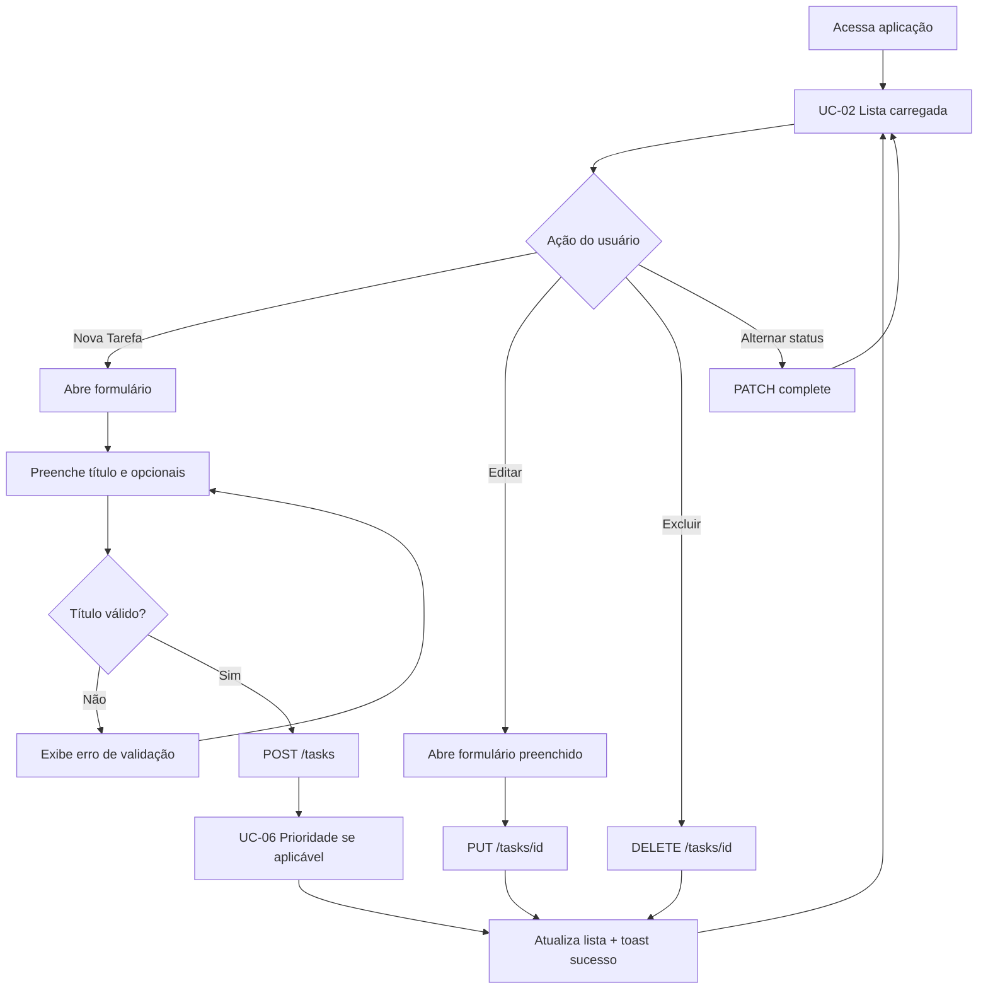
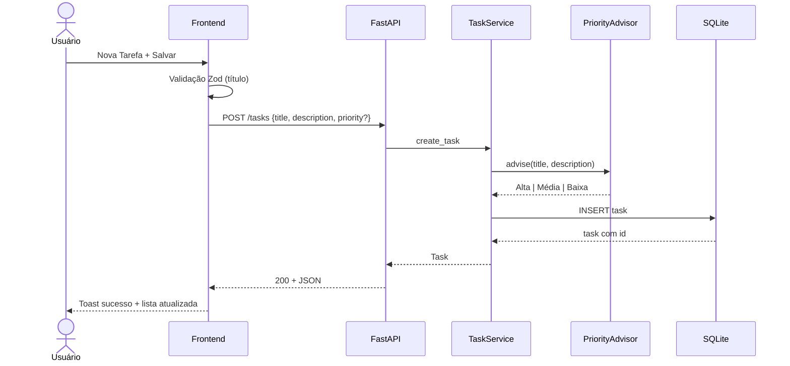
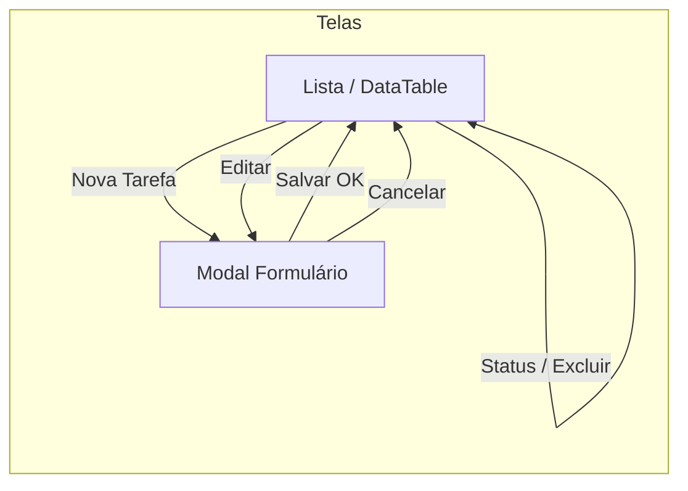

# Fluxos de navegação e protótipos lógicos

Complementam os wireframes HTML e rastreiam os casos de uso UC-01 a UC-05.

---

## 1. Fluxo principal do usuário (happy path)



---

## 2. Fluxo de criação com regra de prioridade



---

## 3. Mapa de telas (protótipo de navegação)



> O MVP usa **duas “telas” lógicas** (lista + modal), o que é suficiente para um CRUD de escopo controlado e evita navegação multi-página desnecessária.

---

## 4. Como visualizar os protótipos HTML

1. Abra no navegador (duplo clique ou “Open with Live Server”):
   - `docs/prototipos/wireframe-lista.html`
   - `docs/prototipos/wireframe-formulario.html`
2. Compare com o protótipo vivo:
   ```bash
   cd frontend
   npm install
   npm run dev
   ```
3. Evidência em vídeo: `Videos/Teste frontend.mp4`
